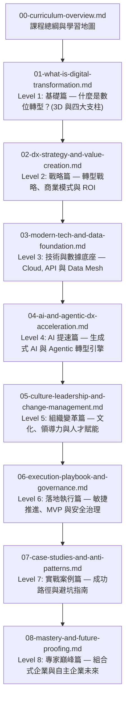

# 00: 數位轉型與 AI 提速實戰全指南 (Digital Transformation & AI Acceleration Master Curriculum)

> **執行摘要 (Executive Summary)**  
> 本課程體系專為企業決策者、產品經理、架構師與工程團隊設計，從基礎概念一路深入至專家級實踐。全面剖析 **Digital Transformation (數位轉型, DX)** 的核心本質、戰略藍圖、底層架構，並著重探討如何利用現代 **Generative AI** 與 **AI Agent (智能體)** 將過去耗時 3~5 年的轉型旅程壓縮至數個月內完成。

---

## 🎯 學習目標 (Learning Objectives)

完成本系列課程後，您將掌握以下核心能力：
1. **概念釐清 (Clarity & Alignment)**：精準區分 **Digitization (數位化)**、**Digitalization (數位優化)** 與 **Digital Transformation (數位轉型)**。
2. **戰略制定 (Strategic Blueprint)**：設計以價值為導向的 DX 戰略，並將其與核心業務 **ROI** 及 **OKRs** 緊密對齊。
3. **架構升級 (Modern Tech Stack)**：掌握 Cloud-native (雲原生)、Microservices (微服務)、API Ecosystem 以及 Modern Data Stack / Data Mesh。
4. **AI 乘數提速 (AI Acceleration)**：運用 Generative AI、LLM、RAG 及 Agentic Workflows 實現 10 倍速的業務流程自動化與創新。
5. **組織與變革管理 (Change Management)**：化解內部阻力，導入敏捷組織架構，建立以數據與 AI 為核心的企業文化 (Data & AI-Driven Culture)。
6. **專案落地與治理 (Execution & Governance)**：落實 Dual-Track Agile、MVP 快速迭代擴展，並建立企業級 Security、Compliance 與 KPI 治理機制。

---

## 🗺️ 模組學習地圖 (Curriculum Roadmap)

> **圖 00.1：數位轉型與 AI 提速課程全景架構圖 (Curriculum Architecture Map)**

> **📌 實戰個案剖析 (Case Study: 8 階段全景路徑實踐)**：
> 參考新加坡星展銀行 (DBS) 與達美樂 (Domino's) 的成功蛻變：從最初釐清 3D 概念（模組 01），制定數位 OKR（模組 02），重構雲端 API（模組 03），導入 AI 預測引擎（模組 04），推動 Squad 敏捷文化（模組 05），到最終建立全球組合式自主企業（模組 08）。本課程全景地圖即為企業提供端到端的升級指南。

---

## 📚 課程章節目錄 (Module Breakdown)

| 模組編號 | 課程單元 | 難度級別 | 適合對象 | 核心產出與概念 |
| :--- | :--- | :--- | :--- | :--- |
| **00** | [00-curriculum-overview.md](file:///c:/ai/digital-transformation/00-curriculum-overview.md) | 全員 | 全體學員 | 課程地圖、學習路徑指南 |
| **01** | [01-what-is-digital-transformation.md](file:///c:/ai/digital-transformation/01-what-is-digital-transformation.md) | 初階 (Beginner) | 業務主管、PM、初學者 | 3D 演進 (Digitization, Digitalization, DX)、四大支柱 (PPTD) |
| **01.1** | [01.1-live-examples-and-analogies.md](file:///c:/ai/digital-transformation/01.1-live-examples-and-analogies.md) | 初階 (Beginner) | 全體學員、跨部門夥伴 | 生活化比喻 (馬車/餐廳/醫療)、米其林/IKEA/SHEIN 真實案例 |
| **01.2** | [01.2-pain-points-and-resolutions.md](file:///c:/ai/digital-transformation/01.2-pain-points-and-resolutions.md) | 全員 (All) | 轉型負責人、主管、工程師 | 8 大真實痛點深入剖析 (員工抗拒、數據孤島、PoC 黑洞) 與實戰解法 |
| **02** | [02-dx-strategy-and-value-creation.md](file:///c:/ai/digital-transformation/02-dx-strategy-and-value-creation.md) | 中階 (Intermediate) | 策略長、產品負責人、專案經理 | 商業模式創新、Digital Maturity Assessment、ROI 衡量指標 |
| **03** | [03-modern-tech-and-data-foundation.md](file:///c:/ai/digital-transformation/03-modern-tech-and-data-foundation.md) | 中階 (Intermediate) | 架構師、技術主管、資深工程師 | Cloud-Native、API Economy、Modern Data Stack、Data Mesh |
| **04** | [04-ai-and-agentic-dx-acceleration.md](file:///c:/ai/digital-transformation/04-ai-and-agentic-dx-acceleration.md) | 進階 (Advanced) | AI 負責人、創新總監、CTO | GenAI、RAG、Agentic Workflows、10x 流程重構 |
| **05** | [05-culture-leadership-and-change-management.md](file:///c:/ai/digital-transformation/05-culture-leadership-and-change-management.md) | 進階 (Advanced) | HRD、轉型辦公室 (PMO)、高階主管 | ADKAR 變革模型、打破部門孤島 (Silos)、AI Literacy |
| **06** | [06-execution-playbook-and-governance.md](file:///c:/ai/digital-transformation/06-execution-playbook-and-governance.md) | 進階 (Advanced) | 專案總監、企業架構師、風控長 | Dual-Track Agile、PoC/MVP 擴展法、Security & Governance |
| **07** | [07-case-studies-and-anti-patterns.md](file:///c:/ai/digital-transformation/07-case-studies-and-anti-patterns.md) | 專家 (Expert) | 轉型負責人、顧問、團隊成員 | 零售/金融/製造實戰案例、十大致命轉型反模式 (Anti-patterns) |
| **08** | [08-mastery-and-future-proofing.md](file:///c:/ai/digital-transformation/08-mastery-and-future-proofing.md) | 專家 (Expert) | CXO、董事會成員、企業戰略家 | Composable Enterprise、Autonomous Enterprise、成熟度自我診斷表 |

---

## 🧭 學習路徑建議 (How to Learn)

1. **體系化通讀 (General Track)**：由 `01` 開始依序研讀，打下扎實的轉型認知、架構視野與執行力。
2. **AI 極速落地路線 (AI Acceleration Track)**：若企業已具備基礎 IT 數位化設施，可優先研讀 **`04` (AI 提速)** 與 **`06` (落地執行)**。
3. **高層戰略視野 (Executive Track)**：著重研讀 **`01`、`02`、`05`、`08`**，掌握商業價值轉化、組織賦能與未來企業架構。

下一步，請進入：**[01-what-is-digital-transformation.md (基礎篇：什麼是數位轉型？)](file:///c:/ai/digital-transformation/01-what-is-digital-transformation.md)**。
