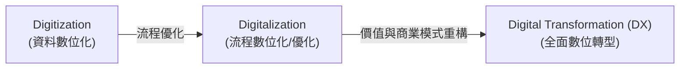
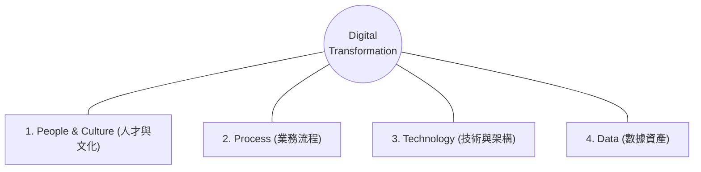

# 01: 什麼是數位轉型？本質與核心維度 (What is Digital Transformation?)

> **核心摘要 (Executive Summary)**  
> 數位轉型（Digital Transformation, DX）不是單純「採購軟體」或「把紙本上傳到雲端」，而是**利用數位技術與數據驅動能力，對企業的商業模式 (Business Model)、營運流程 (Operating Model) 及組織文化 (Culture) 進行根本性的重構**，為客戶與企業持續創造新價值。

---

## 🔍 1. 關鍵辨析：3D 演進階梯 (Digitization vs Digitalization vs DX)

許多企業轉型失敗的第一個原因，就是混淆了以下三個層次：

> **圖 01.1：3D 數位化演進階梯圖 (The 3D Evolution Ladder)**

> **📌 實戰個案剖析 (Case Study: 傳統保險公司的 3D 演進歷程)**：
> - **Digitization 階段**：保險公司將過去 30 年紙本保單掃描成 PDF 檔案放進硬碟。效益：省下倉庫租金，但客戶買保險仍然要填紙本。
> - **Digitalization 階段**：推出業務員專用 iPad App 進行電子簽名與自動核保（省下 3 天行政流程）。效益：出單速度提升 50%，但保險產品本身沒有變。
> - **Digital Transformation 階段**：推出「碎片化即時車險 / 外送員保險 App」，透過手機陀螺儀與 GPS 即時監測駕駛行為（UBI 保險），優良駕駛自動減免保費，並透過 API 嵌入到 Uber/Foodpanda 平台。效益：開創全新年輕客群與生態系營收。

| 維度 | 1. Digitization (資料數位化) | 2. Digitalization (流程數位化) | 3. Digital Transformation (數位轉型) |
| :--- | :--- | :--- | :--- |
| **定義** | 將物理、類比資訊（Analog）轉換為二進位數位格式（Digital bits）。 | 利用數位技術優化現有業務流程，提升營運效率與自動化程度。 | 以客戶為中心，徹底重塑業務流程、商業模式與企業文化，創造全新的價值成長曲線。 |
| **關注核心** | 資訊載體（Data Format） | 內部營運效率（Operational Efficiency） | 商業模式創新與客戶體驗（Value Proposition & CX） |
| **典型範例** | 將紙本合約掃描為 PDF 檔存入硬碟。 | 導入電子簽名系統（如 DocuSign）並結合 ERP 自動核銷審批流程。 | 開發訂閱制數位合約智能分析平台，透過 AI 即時預警合約風險並自動生成合約（SaaS / API 商業模式）。 |
| **對企業影響** | 降低存儲與紙張成本。 | 縮短工時、減少人為錯誤。 | 開發新營收來源、重構市場競爭優勢、建立敏捷組織。 |

---

## 🏛️ 2. 數位轉型的四大核心支柱 (The 4 Pillars of DX: PPTD)

一場成功的 DX 必須由 **PPTD** 四大維度協同推動，缺一不可：

> **圖 01.2：數位轉型四大核心支柱架構圖 (The 4 Pillars: PPTD)**

> **📌 實戰個案剖析 (Case Study: 達美樂披薩的 PPTD 四支柱落地)**：
> 1. **People (人才文化)**：管理層宣示「我們不是快餐店，而是一家碰巧在賣披薩的科技公司」，獎勵全員提出數位改進提案。
> 2. **Process (業務流程)**：打破傳統打電話點餐，重構端到端體驗，首創「Pizza Tracker」讓顧客實時查看麵糰發酵、進烤箱與外送位置。
> 3. **Technology (技術架構)**：自建開放 API 與雲端架構，支援 Apple Watch、車載系統、Twitter 甚至 Smart TV 一鍵 emoji 叫披薩。
> 4. **Data (數據資產)**：收集百萬客戶點餐偏好，精準預測各分店備料量，將披薩製作前置時間縮短至 3 分鐘內。

### 1. People & Culture (人才與文化)
- **Growth Mindset (成長型思維)**：容許失敗與快速試錯，鼓勵跨部門協作。
- **Data & AI Literacy (數據與 AI 素養)**：讓非技術人員也能理解數據價值並使用 AI 工具。
- **打破 Silos (組織孤島)**：打破業務部門（Business）與 IT 部門之間的隔閡，組建跨職能敏捷小組（Cross-functional Agile Squads）。

### 2. Process (業務流程)
- **Customer-Centric (以客戶體驗為中心)**：從使用者的端到端體驗（Journey Mapping）出發，而不是從現有系統出發。
- **Agile & Lean (敏捷精實)**：消除無效步驟，透過 Continuous Feedback Loop 持續迭代改進。
- **Hyperautomation (超級自動化)**：將重覆性高、規則明確的手工流程全面自動化。

### 3. Technology (技術與架構)
- **Cloud-Native Architecture (雲原生架構)**：彈性擴展、高可用、按需付費。
- **API-First & Modular Design (API 優先與模組化架構)**：解耦巨石系統（Monolith），實現隨插即用的敏捷開發。
- **Modern Security (現代安全防護)**：導入 Zero Trust (零信任) 與 DevSecOps。

### 4. Data (數據資產)
- **Data as a Product (數據即產品)**：將數據視為具備商業價值的核心資產，而非被動的報表記錄。
- **Real-time Analytics (即時分析與決策)**：從「後見之明 (Descriptive)」邁向「預測性 (Predictive)」與「處方性 (Prescriptive)」分析。
- **Unified Data Platform (現代統一數據平台)**：消除數據孤島，建立高質量、可信賴的 Single Source of Truth。

---

## 🚫 3. 企業對數位轉型的五大常見迷思 (Common Misconceptions)

> [!WARNING]
> 1. **迷思一：「DX 只是 IT 部門的事情」**  
>    **真相**：DX 是以商業價值為導向的戰略變革，必須由 CEO/董事會親自領軍，業務部門主導痛點與目標，IT/AI 團隊作為賦能夥伴。
> 
> 2. **迷思二：「導入昂貴的雲端系統或 AI 工具就代表轉型成功」**  
>    **真相**：如果底層流程沒有優化、員工習慣沒有改變，導入新軟體只會變成「昂貴的數位垃圾」。
> 
> 3. **迷思三：「轉型是一次性的專案（Project），做完就結束」**  
>    **真相**：DX 是一項持續演進的組織能力（Capability），而非有固定結束日期的專案。
> 
> 4. **迷思四：「數位轉型是大型企業的專利」**  
>    **真相**：中小企業反而擁有更高的組織敏捷度（Agility），透過 SaaS 與 GenAI API 可以用更低的成本實現跳躍式升級。
> 
> 5. **迷思五：「AI 會直接取代所有的轉型規劃」**  
>    **真相**：AI 是轉型的**加速器 (Accelerator)**，若沒有清晰的戰略與高質量的數據底座，AI 只會加速產出錯誤結果（Garbage in, Garbage out）。

---

## 📊 4. 轉型驅動力分析 (Why Transform Now?)

企業推動數位轉型通常源於兩大驅動力：
1. **外部壓力 (Market Disruption)**：
   - 客戶期望改變：要求全通路（Omnichannel）、即時回應與高度客製化。
   - 新興競爭者威脅：原生數位公司（Digital Natives）以輕資產、高效率模式顛覆傳統市場。
   - 供應鏈與法規變化：ESG 揭露要求、數據合規（如 GDPR）與跨國供應鏈透明度。
2. **內部迫切性 (Internal Imperatives)**：
   - 傳統 Legacy 系統維護成本高昂且難以維護。
   - 跨部門協作效率低下，流程充斥大量人工作業與審批瓶頸。
   - 決策缺乏數據支撐，錯失市場先機。

---

## 📝 課後反思與自我評估 (Self-Assessment)

請思考貴公司目前的現狀並回答以下問題：
1. 貴公司最近推動的各項 IT 專案，究竟屬於 **Digitization**、**Digitalization** 還是 **Digital Transformation**？
2. 評估團隊在 **PPTD (People, Process, Technology, Data)** 四個支柱中，哪一個維度目前是最大的瓶頸？
3. 如果競爭對手在未來 6 個月內利用 AI 自動化了 80% 的核心業務流程，貴公司將面臨何種衝擊？

---

**下一單元**：深入探討如何制定轉型藍圖與計算投資回報率：  
👉 **[02-dx-strategy-and-value-creation.md (戰略篇：轉型戰略、商業模式與 ROI)](file:///c:/ai/digital-transformation/02-dx-strategy-and-value-creation.md)**
