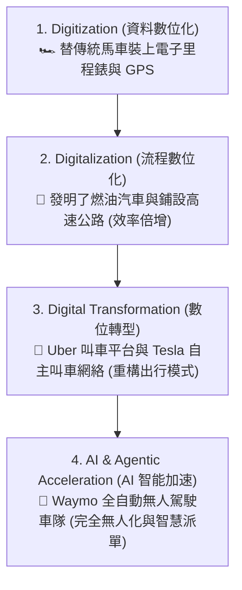
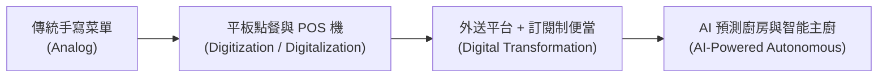
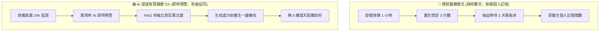

# 01.1: 數位轉型實戰比喻與生活化案例手冊 (Live Examples & Intuitive Analogies)

> **導讀 (Introduction)**  
> 抽象的術語常常讓人難以理解。本篇用最接地氣的**生活化比喻 (Intuitive Analogies)** 與 **真實商業案例 (Live Examples)**，為您生動解析「數位轉型」與「AI 提速」的本質。

---

## 🏎️ 比喻一：出行工具的進化史（從馬車到自動駕駛）

這是解釋 **3D 概念 (Digitization ➔ Digitalization ➔ Digital Transformation)** 最經典的比喻：

> **圖 01.1.1：出行工具進化與轉型對照圖 (Transportation Evolution Analogy)**

| 階段 | 生活化比喻 (Intuitive Analogy) | 傳統企業真實對照 | 帶來的核心改變 |
| :--- | :--- | :--- | :--- |
| **1. Digitization (資料數位化)** | **紙本帳本拍成照片存入手機** • 帳本本質沒變，僅換成電子位元 | 將實體發票或合約掃描為 PDF 檔存放硬碟 | 節省實體空間，流程本質未變 |
| **2. Digitalization (流程數位化)** | **用 Excel 記帳並設定自動加總公式** • 計算變快了，節省按計算機時間 | 導入 ERP 系統或網上電子表單簽核審批 | 流程提速 30%，但賣同樣產品給同樣客人 |
| **3. Digital Transformation (數位轉型)** | **不是改進計程車，而是發明 Uber** • 即時匹配、自動扣款、雙向評價 | Netflix 從「出租實體 DVD」轉為「線上串流 + 演算法訂閱」 | **商業模式重構**，創造全新營收曲線 |
| **4. AI Acceleration (AI 提速)** | **從真人開車到 Waymo 無人車隊 (Robotaxi)** • 派單、導航、避障、營運全自主閉環 | 傳統車險理賠需 7 天；現在拍照上傳，**多模態 AI 3 秒定損並調 API 秒級撥款** | 流程週期從「週」降至「秒級」，成本呈指數級下降 |

---

## 🍽️ 比喻二：餐廳經營的四個世代（直觀理解企業升級）

想像你開了一家傳統熱炒店：

> **圖 01.1.2：餐飲業四個世代升級路徑圖 (Restaurant Evolution Analogy)**

1. **傳統時代 (Analog)**：服務生拿紙筆點餐，廚房看手寫單炒菜，常漏單、字跡潦草。
2. **數位化時代 (Digitization & Digitalization)**：桌上放 QR Code 掃碼點餐，後廚螢幕即時跳單，結帳刷信用卡或電子錢包。*(效率大幅提高，但你依舊是一家只做方圓 500 公尺客人的餐廳)*。
3. **數位轉型時代 (Digital Transformation - 商業模式改變)**：
   - 你不再依賴實體店面坪數，改做「雲端廚房 (Ghost Kitchen)」。
   - 推出「週一到週五健康午餐訂閱制 App」，透過數據分析常客偏好，提早採購食材降低報廢率。
   - 開發冷凍調理包，透過電商跨國販售。*(你已經從一家地方熱炒店，轉變成一家食品科技與餐飲品牌公司)*。
4. **AI 加速時代 (AI & Agentic Acceleration)**：
   - **AI 需求預測**：AI 自動結合明天下雨機率、周邊辦公大樓活動，精準預測明天需準備 120 份牛肉與 80 份雞肉，食材浪費降至 0%。
   - **AI 行銷小助手**：AI 自動給 30 天未光顧的老顧客發送專屬口味折扣券。
   - **智能客服 Agent**：外送訂單發生延誤時，AI 客服主動偵測、發送道歉訊息並自動補償點數，完全不需店長介入。

---

## 🏥 比喻三：醫療診斷的變革（理解 AI Agent 提速）

> **圖 01.1.3：傳統就醫 vs AI 提速智慧醫療流程對比圖 (Healthcare DX Transformation)**

> **📌 模式價值對比剖析**：
> - **傳統看診**：流程割裂、數據滯後、診斷效率受限於單一醫生體力與記憶極限。
> - **AI 提速後的智慧醫療**：將「被動看病」轉變為「主動健康管理」；RAG 知識庫比對加上 AI Agent 工具調用，將診斷決策前置時間由 **「天級」縮短至「秒級」**。

---

## 💡 真實世界活生生的案例 (Live Case Snapshots)

### 案例 1：傳統輪胎大廠 Michelin (米其林)
- **過去的生意**：生產輪胎，按「一條輪胎多少錢」賣給貨運卡車公司。卡車司機常為了省錢磨平輪胎才換，導致爆胎意外頻繁。
- **轉型後的 DX 模式**：
  - 米其林在輪胎內部植入 IoT 感測器，推出 **「EFFIFUEL (按行駛公里數付費)」** 訂閱服務。
  - 卡車公司不用花大錢買輪胎，而是按「行駛里程」付服務費。
  - 米其林利用 AI 監測胎壓與磨損，在輪胎快壞之前主動派人更換，並用 AI 演算法指導司機如何駕駛最省油。
  - **雙贏結果**：客戶省下油錢與爆胎風險，米其林獲得了長期穩定的循環訂閱收入 (Recurring Revenue)。

---

### 案例 2：IKEA (宜家家居) —— 從厚重型錄到 AI 空間設計師
- **過去**：每年印製數千萬本厚重的紙本產品目錄寄給家庭，客戶需拿捲尺到門市量尺寸。
- **轉型後**：
  - 停印紙本型錄，推出 **IKEA Kreativ (AI & AR App)**。
  - 客戶拿起手機掃描自家客廳，AI 自動將現有舊家具「一鍵抹除（擦除）」，並根據房間真實空間比例，讓客戶隨意拖放 IKEA 沙發與書櫃。
  - 一鍵加入購物車並預約到府組裝。

---

### 案例 3：傳統服飾快時尚 SHEIN —— 極致的 AI 演算法轉型
- **傳統快時尚 (如 ZARA/H&M)**：設計師預測流行趨勢 ➔ 訂單生產幾千件 ➔ 運到門市測試銷量 ➔ 沒賣掉的打折清倉（週期約 2~4 週）。
- **SHEIN 的 AI 即時演算法模式 (Real-time Retail)**：
  - AI 爬蟲 24 小時自動抓取 TikTok、Instagram 上最熱門的流行顏色與版型。
  - AI 輔助生成設計圖，直接對接中國小型工廠，首批只生產 **100 件** 放到網站測水溫。
  - 網站一旦偵測到點擊與加購率飆升，系統**自動調用 API 下單給工廠加單 2,000 件**；若反應冷淡則立即停產。
  - 庫存未售出率降至驚人的 **3%**（傳統行業為 30%）。

---

## 🎯 核心啟示總結 (Key Takeaways)

> [!TIP]
> 1. **不要做「跑得很快的馬車」，要做「重新定義出行的平台」**。
> 2. **AI 的價值在於「消除等待與摩擦」**：把以「天」為單位的流程，壓縮成以「秒」為單位的即時體驗。
> 3. **數據不是拿來存的，是拿來即時產生行動的 (Data to Action)**。
