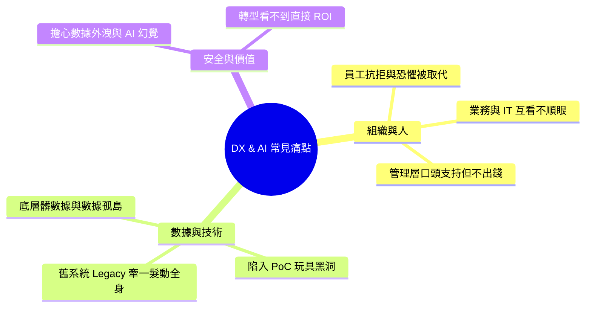

# 01.2: 轉型常見痛點與實戰解法大全 (Pain Points, Blockers & Actionable Solutions)

> **導讀 (Introduction)**  
> 90% 的企業在推動數位轉型與導入 AI 時，都會遇到極為相似的「瓶頸（Bottlenecks）」與「內耗（Friction）」。本手冊梳理了業界討論度最高、最棘手的 **8 大真實問題 (Real-world Pain Points)**，並給予具體可落地的 **破局解法 (Actionable Playbook)**。

---

## 🗺️ 轉型常見問題總覽 (The Problem-Solution Matrix)



---

## 💥 痛點 1：員工排斥新系統，私下繼續用 Excel 偷偷作業 (Adoption Resistance)

### 🔴 典型現象：
公司花費數百萬導入了全新 CRM/ERP 或 AI 輔助工具，上線 3 個月後，後台數據顯示「活躍使用率只有 15%」。員工抱怨：「新系統步驟繁瑣」、「點選 10 個按鈕還不如我打字或用 Excel 複製貼上快」。

### 🟢 根本原因 (Root Cause)：
- 設計系統時是由總部 IT/管理層拍板，**完全沒有一線操作人員參與 (Built without empathy)**。
- 只有「命令」，沒有回答員工內心的核心問題：**「這能幫我準時下班嗎？（WIIFM - What's In It For Me?）」**。

### 🛠️ 破局解法 (Resolution Playbook)：
1. **「痛點清單共創」**：不要一開始就強推大系統。找 3 位一線骨幹員工，請他們列出「每天工作最想吐、最浪費時間的 3 件事」（如手動核對發票、每週五整理匯總報表）。
2. **AI Copilot 自動化替代手動輸入**：將新系統介面「自然語言化」或「自動化」。例如：不再要求員工填寫 20 個表單欄位，而是提供「貼上對話記錄，AI 自動抽取並填好欄位」的功能。
3. **設立「過渡保護期」與「雙軌獎勵」**：公開表彰使用新工具節省最多時間的員工，並給予實質獎勵；同時設定舊表格的「正式退役倒數日（Sunsetting Date）」，杜絕雙軌混亂。

---

## 💥 痛點 2：業務部門 (Business) 與 IT/AI 團隊互相踢皮球 (Business-IT Silo)

### 🔴 典型現象：
- 業務說：「IT 開發太慢，提一個需求要等 6 個月，上線時市場早就變了！而且做出來的東西根本不能用！」
- IT 說：「業務需求天天改，一開始連自己要什麼都說不清楚，把我們當作免費用外包按鈕！」

### 🟢 根本原因 (Root Cause)：
- **KPI 考核衝突**：業務考核的是「營收增長與客戶交付速度」；IT 考核的是「系統穩定性與 bug 率（不出事為原則）」。
- 傳統「客戶-供應商」心態，缺乏共同承擔責任的機制。

### 🛠️ 破局解法 (Resolution Playbook)：
```mermaid
flowchart LR
    subgraph 傳統割裂模式 (踢皮球)
        B1[業務提 PRD 需求] -->|扔過牆| IT1[IT 封閉開發 6 個月] -->|交付| B2[業務驗收發現不符合]
    end

    subgraph 現代 Squad 敏捷融合 (共擔責任)
        B3[業務 Product Owner] <-->|每日站會 & 2週迭代| IT2[工程/AI 架構師]
        B3 & IT2 --> G[共同背負業務增長 OKR]
    end
```
1. **推行「業務即 Product Owner」制度**：禁止業務只寫幾頁模糊的需求文檔就甩手不管。必須指派一名業務核心骨幹擔任產品負責人（PO），全程參與 Sprint 規劃與每週展示會（Demo）。
2. **綁定共同 OKR**：專案目標不再是「系統順利上線」，而是「客戶轉化率提升 15%」或「訂單處理時間降低 50%」。如果業務目標未達成，IT 與業務共同承擔。

---

## 💥 痛點 3：數據亂七八糟、各部門資料對不齊 (Data Chaos & Silos)

### 🔴 典型現象：
想導入 AI 智慧推薦或自動分析，卻發現：
- 行銷部的「客戶名單」和財務部的「開票名單」格式完全不同，同一個客戶在不同系統有 4 個不同的 ID。
- 歷史資料大量缺失、欄位填寫隨意（例如電話號碼欄位填寫了「李先生轉交」）。

### 🟢 根本原因 (Root Cause)：
過去 10 年各部門各自採購小型軟體，缺乏全公司統一的 **Data Governance (數據治理)** 與 **Single Source of Truth (單一真實數據源)**。

### 🛠️ 破局解法 (Resolution Playbook)：
1. **不要試圖「一次洗乾淨全公司 10 年數據」**：這會耗費幾年且容易流產。採用 **「用例驅動的數據清洗 (Use-Case Driven Cleansing)」**——只清洗當前第一個高價值 AI 專案所需的最小核心數據集（如最近 6 個月的有效訂單與活躍會員）。
2. **導入現代語意層 (Semantic Layer) 與 Master Data Management (MDM)**：建立全域唯一「客戶主鍵 (Master Customer ID)」，統一所有系統的對齊標準。
3. **利用 LLM 進行非結構化資料清洗**：以往需要人工花幾個月整理的舊備註欄位，交給 LLM + Python 腳本在數小時內自動抽取、標準化與打標籤。

---

## 💥 痛點 4：概念驗證做了 20 個，沒有一個能上線 (PoC Purgatory)

### 🔴 典型現象：
公司成立了創新實驗室或 AI 小組，做出了各種酷炫的 Demo（如內部的對話機器人、智慧圖像辨識），在管理層前演示獲得滿堂彩，但過了一年，**沒有任何一個真正整合進實際業務系統跑生產流量**。

### 🟢 根本原因 (Root Cause)：
- **「玩具思維」而非「工程思維」**：在 Jupyter Notebook 或本機展示很簡單，但正式上線面臨：高並發崩潰、缺乏權限隔離、資安不過關、沒有連接正式 API。

### 🛠️ 破局解法 (Resolution Playbook)：
1. **「上線倒數時間盒 (4-Week Timebox)」**：任何 AI / DX 實驗從啟動第一天起，必須明確定義上線時間點與生產整合架構，若 4 週內無法打通端到端生產閉環，立即檢討或叫停。
2. **Day 1 納入資安與架構團隊**：不要等 Demo 做完了才找資安與合規部門審查；在立項的第一天就讓資安人員定義合規紅線（如數據脫敏規則）。
3. **制定 PoC 畢業標準 (Graduation Criteria)**：
   ```
   [ ] 準確率 / 業務解決率達到預定門檻 (如 > 85%)
   [ ] 單次 API 調用成本在商業模型可承受範圍內 (< $0.02)
   [ ] 具備 Human-in-the-loop 人工審核與降級容錯機制
   ```

---

## 💥 痛點 5：Legacy 老舊核心系統「牽一髮動全身」，不敢輕易碰 (Legacy Debt)

### 🔴 典型現象：
公司核心業務跑在一套運行了 15 年的古老系統（如老舊 AS400、COBOL 系統、封閉的傳統 ERP）上。當年的工程師早已離職，代碼無人敢改，新需求無法直接開發。

### 🟢 根本原因 (Root Cause)：
過度緊密耦合的單體架構（Spaghetti Monolith）。

### 🛠️ 破局解法 (Resolution Playbook)：
```mermaid
flowchart TD
    subgraph 絞殺者模式 (Strangler Fig Pattern)
        USER[前端用戶 / App] --> API[API Gateway 智能流量網關]
        API -->|新功能 / 新流量 (80%)| NEW[現代微服務 & AI 智能體]
        API -->|未遷移老功能 (20%)| OLD[Legacy 老舊核心系統]
        NEW -.->|後台非同步同步數據| OLD
    end
```
1. **嚴禁「推倒重來 (Big Bang Rewrite)」**：歷史證明 80% 的推倒重寫專案最終都會嚴重超期超支甚至失敗。
2. **採用「Strangler Fig Pattern (絞殺者模式)」**：
   - 在老系統前面架設一層 **API Gateway**。
   - 所有新功能（如 AI 智能客服、行動下單）全部在現代雲端微服務上開發。
   - 透過 API 逐步接管老系統的讀寫流量，像絞殺藤一樣逐漸包覆老系統，最後在無感狀態下將老系統正式拔插頭。

---

## 💥 痛點 6：高層「口頭支持」，但一談到要撥預算就猶豫 (Executive Hesitation)

### 🔴 典型現象：
CEO 在年度會議上大談「我們要全面擁抱 AI 與數位轉型」，但當技術團隊提出轉型方案時，CFO 卻問：「這個專案下個月能多賺多少錢？如果看不到立刻回本，預算先砍半。」

### 🟢 根本原因 (Root Cause)：
技術團隊只用「技術術語（如微服務、K8s、RAG、向量庫）」向董事會報告，未將技術收益轉化為 **CFO 聽得懂的 P&L 財務語言**。

### 🛠️ 破局解法 (Resolution Playbook)：
1. **報告語言徹底「商業化」**：
   - ❌ *錯誤說法*：「我們需要 50 萬美元建構企業級 RAG 知識庫與向量檢索微服務架構。」
   -  *正確說法*：「這項投資能將新進業務員的培訓出單週期從 90 天縮短至 21 天，預計在 Q3 為公司額外創造 180 萬美元的銷售增量，並節省 30% 客服人力外包成本。」
2. **採用「分階段階梯式撥款 (Stage-Gate Funding)」**：
   - 第一階段：只申請 2 萬美元做 3 週驗證，證明效益。
   - 第二階段：拿出第一階段成果與數據，再解鎖 10 萬美元做小規模試點。
   - 降低高層的決策風險感。

---

## 💥 痛點 7：擔心商業機密洩漏給 AI，或被 AI 幻覺坑害 (Security & Hallucination)

### 🔴 典型現象：
法務與資安長（CISO）直接在全公司下達禁令：「嚴禁所有員工使用任何 AI 工具，以防客戶資料被 OpenAI / 外部廠商拿去訓練，一旦洩密責任自負。」

### 🟢 根本原因 (Root Cause)：
缺乏企業級的 **AI 安全架構** 與 **護欄機制 (Guardrails)**。

### 🛠️ 破局解法 (Resolution Playbook)：
1. **建立「企業專屬安全網關 (Enterprise AI Gateway)」**：
   - 簽署具有「Zero Data Retention (不保留數據作訓練)」的企業級雲端 API 協議（如 Azure OpenAI, AWS Bedrock, GCP Vertex AI）。
   - 在所有 Prompt 送出前，自動經由網關進行 **PII 脫敏（自動遮蔽身分證號、信用卡號、客戶姓名）**。
2. **防範幻覺的「雙重驗證閉環」**：
   - 導入 **RAG 溯源技術**：AI 輸出的每一句話必須標註參考來自內部哪一份文件的第幾頁（Clickable Citation）。
   - **Confidence Score 信心度閥值**：若 AI 回答信心度低於 85%，系統自動切換為「抱歉，此問題需轉接人工專家處理」，絕不盲目胡編。

---

## 💥 痛點 8：熱情過後，全員陷入「變革疲勞 (Change Fatigue)」

### 🔴 典型現象：
轉型推行了 9 個月，初期的新鮮感過去了。專案不斷出現小問題，各部門疲憊不堪，大家開始私下抱怨：「以前沒搞什麼轉型時，日子還好過得多。」

### 🟢 根本原因 (Root Cause)：
把轉型當作一場漫長的「苦行僧長跑」，缺乏持續的成就感與階段性慶祝。

### 🛠️ 破局解法 (Resolution Playbook)：
1. **打造「微型勝利嘉年華 (Celebrating Quick Wins)」**：不要等到 2 年後大專案完成才慶祝。每當一個小組透過 AI 工具節省了每週 5 小時工時，立即在全員大會表彰，並發放實質獎品或放假半天。
2. **將成果可視化 (Make Progress Visible)**：在辦公室螢幕或 Slack/Teams 頻道設置即時看板，動態滾動：「本週全公司 AI 已累計幫大家省下 1,420 小時加班時間」。
3. **「減法原則」**：每次導入一個新數位工具，必須強制廢除至少兩個舊的繁文縟節或審批表格，讓員工真正感受到負擔在減輕，而不是只在疊加工作。

---

## 📋 總結：化解轉型阻力的三句箴言

> [!TIP]
> 1. **「同理心重於技術」**：永遠從一線員工與終端客戶的真實痛苦出發。
> 2. **「以小勝積大勝」**：拒絕完美主義，用 2 週一個小閉環的成果建立信任。
> 3. **「制度與工具並行」**：改變工作習慣靠的不是自律，而是讓「正確的做事方式」變成「阻力最小的方式」。
