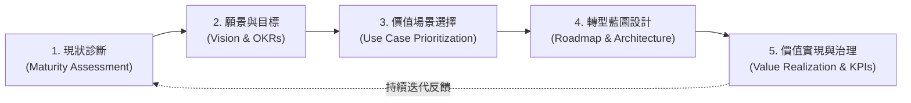
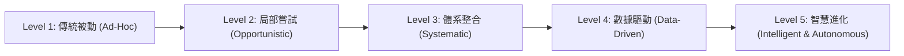
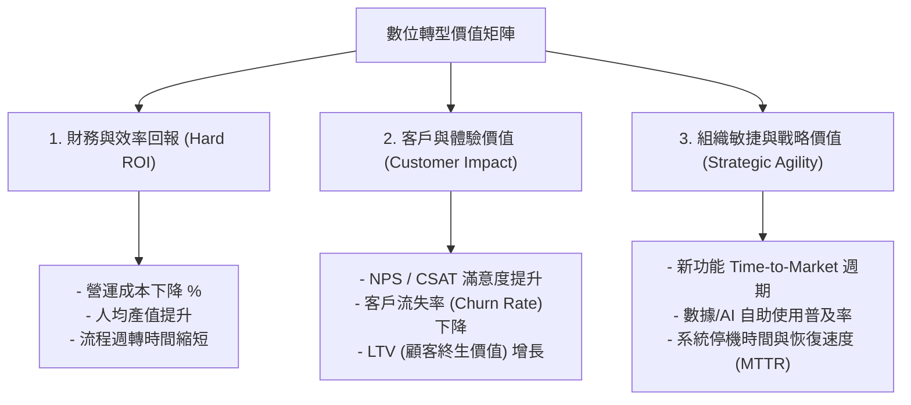

# 02: 轉型戰略、商業模式與 ROI 價值衡量 (DX Strategy & Value Creation)

> **核心摘要 (Executive Summary)**  
> 數位轉型若無明確的商業戰略指引，極易淪為「為了技術而技術」的無底洞投資。本章將教您如何運用**數位成熟度模型 (Digital Maturity Model)** 評估現狀、重塑**商業模式 (Business Model Innovation)**，並建立可量化、可追蹤的 **ROI 與 OKRs 價值實現框架**。

---

## 🧭 1. 數位轉型戰略規劃五步法 (The 5-Step DX Strategy Framework)

企業制定 DX 戰略應遵循嚴謹的閉環流程：



1. **現狀診斷 (Where are we now?)**：評估現有技術債（Technical Debt）、數據就緒度（Data Readiness）、文化阻力與營運瓶頸。
2. **確立願景 (Where do we want to go?)**：定義轉型北極星指標（North Star Metric）與 3 年長期目標。
3. **場景優先級篩選 (Which bets should we make?)**：透過「價值 vs 複雜度矩陣」挑選出高回報、快速落地的 Quick Wins。
4. **藍圖設計 (How do we get there?)**：規劃技術架構演進、人才招募培訓、專案階段里程碑（Milestones）。
5. **價值實現 (Are we creating real impact?)**：設立營收增長、成本優化、客戶滿意度等量化指標與治理常規。

---

## 📈 2. 數位成熟度評估模型 (Digital Maturity Model - DMM)

企業的數位能力通常劃分為五個階段。了解自身處於哪一階段，才能制定務實的升級路徑：



| 成熟度階段 | 特徵描述 | 典型痛點 | 升級關鍵動作 |
| :--- | :--- | :--- | :--- |
| **Level 1: Ad-Hoc (傳統被動)** | 大量紙本或分散 Excel 操作，IT 被視為單純的硬體維護成本中心。 | 資訊嚴重滯後、人為出錯率極高。 | 核心業務標準化、啟動核心資料數位化 (Digitization)。 |
| **Level 2: Opportunistic (局部嘗試)** | 各部門自建孤立軟體系統（如獨立 CRM、行銷工具），系統間無法串接。 | 數據孤島 (Data Silos)、重複採購。 | 建立企業級 IT/數據治理架構，推動跨部門 API 串接。 |
| **Level 3: Systematic (體系整合)** | 核心流程線上化，ERP/CRM/MES 全面打通，具備統一的數據倉儲。 | 系統架構僵化、需求交付週期長。 | 導入雲原生架構、敏捷開發與現代數據平台。 |
| **Level 4: Data-Driven (數據驅動)** | 決策基於即時 BI 與預測模型，組織習慣用數據說話。 | 傳統預測模型維護成本高、應變速度仍受限。 | 全面擁抱 AI、導入 GenAI 智慧代理與工作流自動化。 |
| **Level 5: Autonomous (智慧自適應)** | 系統具備自我優化、即時自適應調整能力，AI Agent 協同完成端到端決策。 | 需持續關注 AI 安全、倫理與合規風險。 | 建立持續創新引擎與生態系開放共生模式。 |

---

## 💡 3. 商業模式創新維度 (Business Model Innovation in DX)

數位轉型不僅是降低內部成本，更要創造新營收曲線：

1. **從「賣產品」到「訂閱服務」 (Product to As-a-Service / XaaS)**：
   - *案例*：傳統工具機製造商轉型為提供「按使用時間/產量付費」的工業雲服務（Equipment-as-a-Service），並透過 IoT 即時預測性維修。
2. **雙邊平台與生態系 (Platform & Ecosystem Business)**：
   - 透過 API 與數位平台連接供應商、合作夥伴與終端客戶，建立網絡效應（Network Effects）。
3. **數據變現與加值服務 (Data Monetization)**：
   - 將沉澱的業務與產業數據在合法合規前提下，清洗聚合為產業洞察報告、風險信用評估模型或 API 商業服務。
4. **超客製化體驗 (Hyper-Personalization at Scale)**：
   - 利用顧客數據平台（CDP）與 AI 即時推薦引擎，為每一位客戶提供獨一無二的產品配置與服務路徑。

---

## 🎯 4. 場景篩選矩陣 (Value vs. Complexity Matrix)

在啟動專案前，利用 2x2 矩陣評估所有潛在專案，確保資源分配最大化：

```
       高 ↑
          │  【Quick Wins (速勝項目)】        │  【Strategic Bets (戰略核心)】
          │  - 特徵：高價值、低複雜度         │  - 特徵：高價值、高複雜度
   商業   │  - 策略：立即執行，建立團隊信心   │  - 策略：分階段拆解，敏捷推進
   價值   │  - 例：AI 自動生成客戶常見回信     │  - 例：全通路統一訂單與庫存中心
 (Value)  ├─────────────────────────────────┼─────────────────────────────────
          │  【Fill-ins (次要改進)】          │  【Money Pits (轉型陷阱)】
          │  - 特徵：低價值、低複雜度         │  - 特徵：低價值、高複雜度
          │  - 策略：有閒置資源時再做/外包   │  - 策略：嚴格避免或果斷叫停
          │  - 例：修改內部非核心表單排版     │  - 例：花千萬重構無人使用的老系統
       低 └─────────────────────────────────┴─────────────────────────────────→
            低                               高
                       實施複雜度 (Complexity / Effort)
```

---

## 💰 5. DX 投資回報率 (ROI) 與 OKRs 評估體系

傳統財務 ROI 計算容易忽略數位化帶來的長期敏捷性與戰略期權價值。建議採用「三維度價值矩陣」：



### 範例：轉型專案 OKR 設定
- **目標 (Objective)**：重構客戶服務流程，打造業界領先的 AI 智慧服務體系。
  - **關鍵結果 1 (KR1)**：將客戶首次平均響應時間由 15 分鐘降至 30 秒內。
  - **關鍵結果 2 (KR2)**：AI 客服智能體直接解決率（FCR）達到 65% 以上。
  - **關鍵結果 3 (KR3)**：客戶整體滿意度（CSAT）由 82 分提升至 94 分，同時客服人員工時負擔減輕 40%。

---

**下一單元**：探討支撐業務轉型的現代底層技術架構與數據平台：  
👉 **[03-modern-tech-and-data-foundation.md (技術底座篇：Cloud, API 與 Data Mesh)](file:///c:/ai/digital-transformation/03-modern-tech-and-data-foundation.md)**
