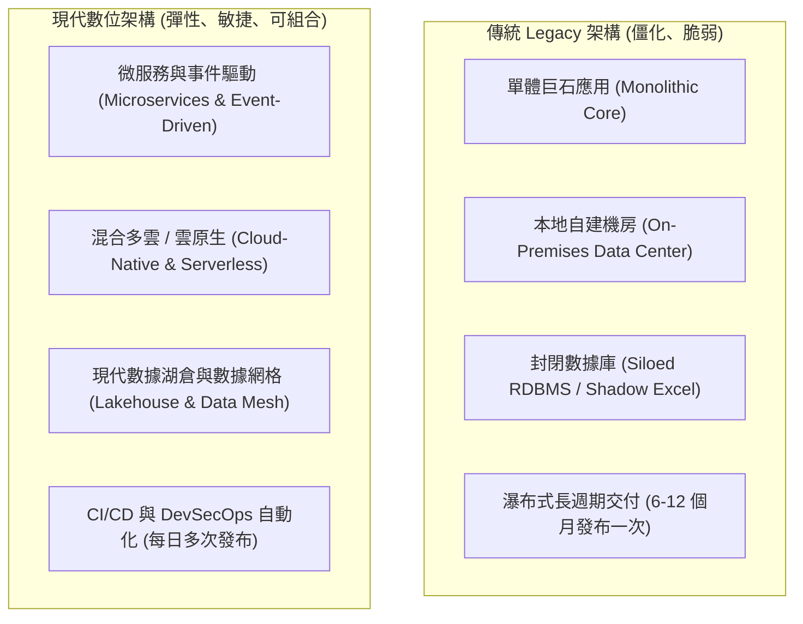
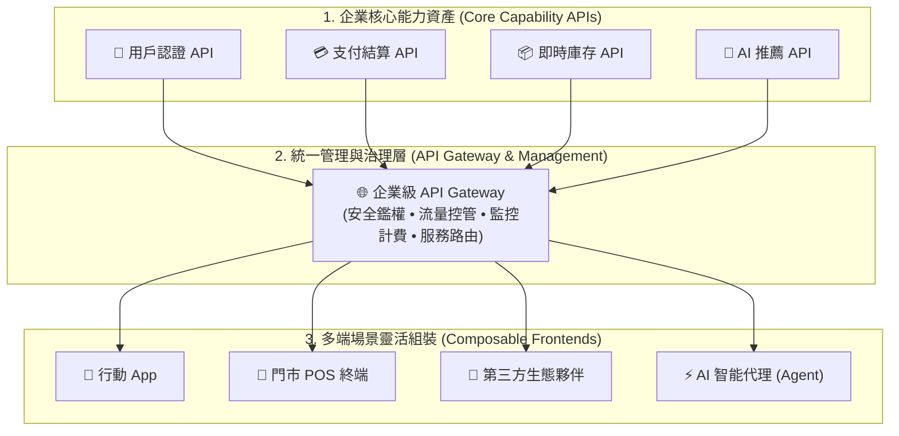
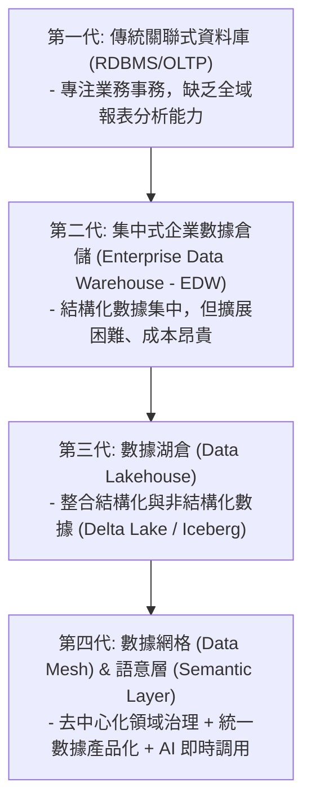

# 03: 現代技術架構與數據底座 (Modern Tech & Data Foundation)

> **核心摘要 (Executive Summary)**  
> 任何宏大的商業轉型藍圖，如果沒有彈性、解耦且可擴展的技術與數據底座支撐，最終都會在技術債與資料孤島中窒息。本章將系統化解析現代數位企業的三大技術基石：**雲原生架構 (Cloud-Native Architecture)**、**API 經濟與微服務 (API Economy & Microservices)**，以及 **現代數據棧與數據網格 (Modern Data Stack & Data Mesh)**，並深入剖析跨產業落地實戰場景。

---

## 🏗️ 1. 企業架構現代化演進 (Architecture Modernization)

傳統企業 IT 架構與現代數位架構的根本差異：

> **圖 03.1：傳統 Legacy 架構 vs 現代雲原生架構對比圖 (Architecture Modernization Evolution)**

> **📌 實戰個案剖析 (Case Study: Netflix 雲原生與微服務架構轉型)**：
> 2008 年 Netflix 曾因本地資料庫損壞導致服務中斷 3 天。隨後痛定思痛，耗時 7 年全面遷移至 AWS 雲端，拆分為數百個微服務，並自研 Chaos Monkey（混沌工程）隨機模擬伺服器斷線以驗證高可用性。如今即使單一 AWS 機房故障，用戶追劇完全無感。

### 關鍵演進路徑：
1. **Infrastructure (基礎設施)**：從 On-Premises 實體機房 ➔ IaaS (雲主機) ➔ PaaS / Serverless (雲原生託管與無伺服器架構)。
2. **Architecture Pattern (架構模式)**：從緊耦合的 Monolithic 架構 ➔ 鬆耦合的 Microservices 與 Event-Driven Architecture (EDA)。
3. **Integration (系統整合)**：從點對點硬編碼串接 (Spaghetti Integration) ➔ API Gateway 與 Event Bus (如 Kafka, RabbitMQ)。

---

## 🔌 2. API 經濟與組合式企業 (API Economy & Composable Enterprise)

現代數位企業將自身的核心能力「API 化」，對內實現敏捷組裝，對外實現生態共創：

> **圖 03.2：API 優先與多端場景組裝架構圖 (API Economy & Composability)**

> **📌 實戰個案剖析 (Case Study: Stripe 支付帝國的 API 優先戰略)**：
> Stripe 僅用「7 行 JavaScript 代碼」的支付 API，徹底顛覆了傳統銀行繁複的刷卡機申請手續。任何電商或開發者 5 分鐘內即可接入全球支付能力，迅速成長為估值數百億美元的 API 巨頭。

### API 優先戰略 (API-First Strategy) 四大原則：
1. **Design Before Code (契約優先設計)**：使用 OpenAPI / Swagger 規範先定義 API 契約，讓前端、後端與合作夥伴並行開發。
2. **Loose Coupling (鬆散耦合)**：底層資料庫或商業邏輯變更不應破壞對外的 API 接口。
3. **API as a Product (API 即產品)**：為 API 提供完善的開發者文檔、SDK、版本管理（Versioning）與 SLA 保證。
4. **Security by Default (預設安全)**：強制採用 OAuth 2.0、OIDC、Rate Limiting 及 API Gateway 統一鑑權。

---

## 💾 3. 數據架構演進：從數據孤島到 Data Mesh (現代數據底座)

數據是 AI 與數位轉型的燃料。企業數據架構經歷了四個世代的演化：

> **圖 03.3：數據架構四世代演進圖 (Evolution to Data Mesh)**

> **📌 實戰個案剖析 (Case Study: 歐洲電商巨頭 Zalando 導入 Data Mesh)**：
> Zalando 過去集中式數據團隊每天要應付數百個部門的改報表需求，不堪重負。轉向 Data Mesh 後，將數據所有權交給行銷、物流、商品等各業務團隊，各自發布高質量的 Data Product，跨部門數據取用時間從 3 週縮短至 5 分鐘。

### 現代數據網格 (Data Mesh) 的四大核心原則：
1. **Domain-Oriented Ownership (領域導向的數據所有權)**：不再由單一集中式數據團隊負責所有清洗，而是由各業務領域團隊（行銷、供應鏈、財務）負責自身數據質量。
2. **Data as a Product (數據即產品)**：每個領域發布高可用、易讀取、具備 SLA 的 Data Product，供全公司分析或 AI 模型使用。
3. **Self-Serve Data Infrastructure (自助式數據平台)**：中央基礎設施團隊提供自動化的 ETL/ELT、存儲與查詢工具（如 Snowflake, BigQuery, Databricks, dbt）。
4. **Federated Computational Governance (聯邦式計算治理)**：建立全公司通用的安全、隱私（GDPR/PIPL）、血緣追蹤（Data Lineage）標準。

---

## 🏢 4. 跨產業實戰落地案例庫 (Industry Real-World Use Cases)

技術架構與數據底座如何真正為不同產業創造千萬級商業價值？以下是 5 大核心產業的真實落地範例：

### 🛒 案例 1：新零售與電商 —— 全球家具龍頭的「全通路即時庫存中台」
- **業務痛點**：線上 App 顯示有貨，客戶驅車 20 公里到門市卻發現已售罄；門市店員無法即時查詢隔壁分店或區域總倉的即時庫存，每年引發上萬宗投訴。
- **技術解法**：
  - 導入 **Apache Kafka 事件驅動架構**，將實體門市 POS 結帳、線上購物車扣減、供應商進貨等事件「毫秒級廣播」。
  - 建立 **單一庫存 API (Global Real-Time Inventory API)**，供官網、App、門市收銀與外送平台統一調用。
- **商業成效**：全通路庫存準確率從 78% 提升至 99.8%，跨店調撥履約時間縮短 60%，缺貨投訴減少 90%。

---

### 🏦 案例 2：金融與銀行業 —— 亞洲頂尖商業銀行的「開放銀行 (Open Banking) API 生態」
- **業務痛點**：傳統信用貸款申請需客戶親臨分行遞交紙本薪資單與稅單，人工審核需 5~7 個工作天，年輕客群大量流失至網路純網銀。
- **技術解法**：
  - 透過 **微服務 + 企業 API Gateway (Kong)**，將核心銀行的「身分認證」、「信用評分」、「轉帳結算」封裝為標準 REST/GraphQL API。
  - 對接房地產搜尋網、大型電商與薪資發放系統（Open Banking 生態）。
- **商業成效**：消費者在電商結帳或買房時直接一鍵授權評估，信貸審批縮短為 **3 秒鐘自動核貸放款**，貸款業務量年增長 300%。

---

### 🏥 案例 3：醫療與生技 —— 跨國醫療集團的「現代臨床數據湖倉 (Lakehouse)」
- **業務痛點**：病患的 CT/MRI 影像（非結構化）、檢驗報告 PDF、電子病歷文字與穿戴手環心率分散在 12 套孤島系統中，難以整合進行罕見疾病 AI 早期篩查。
- **技術解法**：
  - 構建基於 **Databricks / Delta Lake 的多模態數據湖倉**，統一儲存影像、音訊與時序健康數據。
  - 建立 **FHIR (Fast Healthcare Interoperability Resources)** 標準醫療數據交換 API 與語意層。
- **商業成效**：AI 模型可在 2 秒內完成全病史多模態比對，肺癌早期篩檢準確率提升 35%，新藥臨床試驗受試者匹配時間從 6 個月降至 3 天。

---

### 🚚 案例 4：物流與供應鏈 —— 全球貨運巨頭的「IoT 邊緣運算與動態調度」
- **業務痛點**：10 萬輛跨國貨車與溫控貨櫃在偏遠地區網絡中斷時無法即時回傳冷鏈溫度；遇上暴風雪或塞港時，調度員依賴電話溝通，造成大量生鮮貨物腐壞。
- **技術解法**：
  - 在貨櫃安裝 **IoT 邊緣計算終端 (Edge Computing)**，在離線狀態下利用輕量級邊緣模型自主監控溫度，超標時自動觸發本地降溫備援。
  - 聯網後即時向雲端傳輸數據，雲端 **AI 智能編排引擎** 根據即時天氣與港口壅塞情況，自動重新計算全美 10,000+ 條最佳路線並推播給司機。
- **商業成效**：冷鏈貨損率降低 85%，全年節省燃油成本逾 4,500 萬美元。

---

### 🏭 案例 5：高科技製造業 —— 晶圓半導體代工廠的「Data Mesh 智慧良率預警」
- **業務痛點**：單一晶圓廠每天產生超過 50TB 感測器數據（溫度、壓力、化學氣體濃度）。傳統集中式 IT 團隊無法理解複雜的半導體物理參數，導致良率異常分析延遲 48 小時。
- **技術解法**：
  - 落地 **Data Mesh (數據網格)**：將數據所有權交由「蝕刻工程組」、「薄膜工程組」與「封測組」等各領域工程團隊。
  - 各組工程師利用 dbt + Snowflake 自行發布高質量的 **「製程良率數據產品 (Yield Data Products)」**。
- **商業成效**：良率異常偵測時間從 **2 天縮短至 15 秒**，單一產線年均減少報廢損失超過 1.2 億元。

---

## 🛠️ 5. 現代技術棧參考架構 (Modern Tech Stack Blueprint)

以下為支撐企業數位轉型與 AI 應用的標準分層架構：

| 層級 (Layer) | 核心技術組件 (Technologies) | 轉型賦能角色 |
| :--- | :--- | :--- |
| **互動與體驗層 (Experience)** | Next.js, React, Mobile Apps, Mini-programs, Conversational UI | 提供響應式、全通路無縫的客戶與員工端體驗 |
| **智能與代理層 (Intelligence)** | LLMs (Gemini, Claude, GPT), LangChain/LlamaIndex, Multi-Agent Orchestrator | 提供語意理解、智能決策、自然語言交互與自主工作流 |
| **業務服務層 (Microservices)** | Go, Node.js, Python, Java Spring Boot, GraphQL, gRPC | 封裝核心業務邏輯，具備高並發與微服務彈性擴展能力 |
| **整合與網關層 (Integration)** | Kong, Envoy, AWS API Gateway, Apache Kafka, EventBridge | 負責流量管控、訊息解耦、系統間非同步事件派發 |
| **現代數據層 (Data Platform)** | Snowflake, Databricks, BigQuery, dbt, Apache Iceberg, Vector DB (pgvector/Pinecone) | 提供即時分析、特徵工程、語意檢索與商業智能決策 |
| **基礎設施與 DevOps (Platform)** | Kubernetes (K8s), Docker, Terraform (IaC), GitHub Actions, Cloud Providers (AWS/GCP/Azure) | 提供自動化編排、持續交付與高彈性算力支撐 |

---

## 🔒 6. 轉型過程中的技術債與安全管理 (Tech Debt & Security)

> [!IMPORTANT]
> - **Legacy 系統遷移策略 (The Strangler Fig Pattern 絞殺者模式)**：切忌「推倒重來 (Big Bang Rewrite)」。應透過 API Gateway 逐步攔截新舊流量，將老系統模組逐一剝離並替換為微服務。
> - **DevSecOps**：在代碼提交（Commit）、構建（Build）、部署（Deploy）全生命週期中自動注入靜態安全掃描（SAST）、依賴項檢查與密鑰保護。
> - **Zero Trust (零信任架構)**：「Never Trust, Always Verify」——所有微服務之間、內部用戶與外部請求均需嚴格鑑權與傳輸加密（mTLS）。

---

**下一單元**：深入探討如何利用生成式 AI 與 AI Agent 將轉型進程提速 10 倍：  
👉 **[04-ai-and-agentic-dx-acceleration.md (AI 提速篇：生成式 AI 與 Agentic 轉型引擎)](file:///c:/ai/digital-transformation/04-ai-and-agentic-dx-acceleration.md)**

