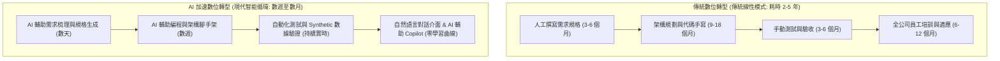
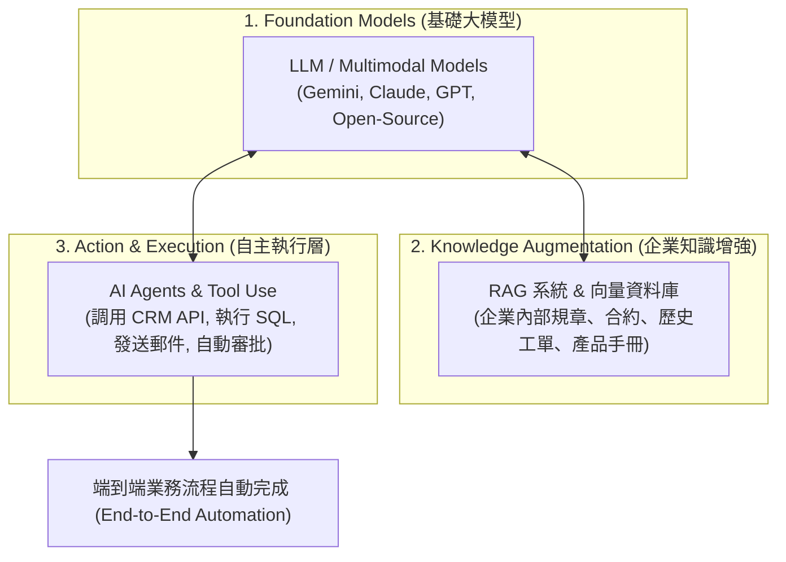
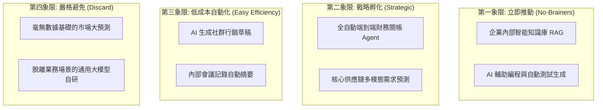

# 04: AI 與 Agentic 驅動的數位轉型提速 (AI & Agentic DX Acceleration)

> **核心摘要 (Executive Summary)**  
> 傳統數位轉型往往耗時 3~5 年，耗費數億預算且容易因需求變更而失敗。**生成式 AI (Generative AI)** 與 **自主智能體 (AI Agents)** 的出現徹底改變了轉型遊戲規則：AI 不僅是轉型交付的**最終成果 (Outcome)**，更是貫穿整個轉型生命週期的**超級加速器 (Catalyst & Accelerator)**。

---

## ⚡ 1. 傳統轉型 vs. AI 加速轉型的範式轉變 (Paradigm Shift)

> **圖 04.1：傳統轉型線性交付 vs AI 智能加速循環對比圖 (Traditional DX vs AI-Accelerated DX)**

> **📌 實戰個案剖析 (Case Study: 摩根士丹利 Morgan Stanley 的 AI 加速實踐)**：
> 過去財務顧問需翻閱 10 萬份內部研報才能回答客戶複雜的理財問題。導入 GPT-4 驅動的內部 AI 助手後，顧問在通話中即時獲得精確研報摘要與合規建議，準備客戶方案的時間從 2 小時縮短至 2 分鐘。

| 維度 | 傳統數位轉型模式 (Traditional DX) | AI 加速轉型模式 (AI-Driven DX) | 提速倍率 (Acceleration Impact) |
| :--- | :--- | :--- | :--- |
| **需求調研與流程梳理** | 顧問訪談、畫數百張 Visio 流程圖（數月） | AI 分析工作日誌/郵件/會議記錄，自動萃取業務流程圖與痛點 | **5x ~ 10x** |
| **軟體開發與系統重構** | 工程師手動撰寫樣板代碼、重寫 Legacy 代碼 | AI 智能編程、自動逆向舊系統代碼 (COBOL/Java to Go) | **3x ~ 5x** |
| **非結構化數據利用** | 難以處理 PDF、合約、音訊，需大量人工謄打 | RAG (檢索增強生成) 與多模態模型即時解析與結構化 | **10x ~ 20x** |
| **用戶操作介面** | 複雜的多層級表單與 ERP 界面，需大量培訓 | Conversational UI (自然語言對話與指令) | **培訓成本降低 80%** |
| **業務決策支援** | 等待每週/每月靜態 BI 報表 | AI Agent 即時監控指標異動，提供根因分析與處方建議 | **從「天級」降至「秒級」** |

---

## 🧩 2. AI 提速的三大技術核心：GenAI, RAG 與 Agentic Workflows

> **圖 04.2：大模型 + RAG 知識庫 + Agentic 工具調用閉環架構圖 (GenAI + RAG + Agentic Stack)**

> **📌 實戰個案剖析 (Case Study: Klarna 先買後付的 AI 客服 Agent)**：
> Klarna 上線基於大模型與 API 調用的 AI 客服 Agent，一個月內處理了 230 萬次客服對話（相當於 700 名全職員工產能），將平均解決時間由 11 分鐘降至 2 分鐘內，同時客服滿意度維持與真人同等水準，為公司帶來 4,000 萬美元的年化利潤改善。

### 1. GenAI & LLMs (語意理解與生成能力)
- 具備世界知識與強大的自然語言/代碼理解力，能將非結構化文字（如客戶投訴、招標書、法規條文）快速分類與摘要。

### 2. RAG (Retrieval-Augmented Generation 檢索增強生成)
- 解決大模型「幻覺（Hallucination）」與「缺乏企業內部私有知識」的問題。
- 將企業沉澱數十年的制度、SOP、技術文檔向量化存儲，讓員工或客戶即時以自然語言精準檢索。

### 3. Agentic Workflows (自主智能體工作流)
- 具備 **Reasoning (推理)**、**Planning (任務拆解)**、**Tool Calling (工具調用)** 與 **Self-Correction (自我修正)** 能力。
- 範例：當收到供應商延遲交付的通知時，AI Agent 可自動：
  1. 查詢 ERP 當前庫存剩餘天數。
  2. 評估是否會影響下游客戶訂單。
  3. 調用供應商 API 尋找備用替代方案並計算成本差額。
  4. 生成決策摘要供採購主管一鍵確認後自動發送 PO。

---

## 🏢 3. 企業各業務職能的 AI 提速落地場景 (Functional Use Cases)

| 業務職能 (Function) | 傳統痛點 (Traditional Bottleneck) | AI 賦能與提速方案 (AI-Powered Solution) | 預期業務價值 (Business Impact) |
| :--- | :--- | :--- | :--- |
| **客戶服務 (Customer Support)** | 人工客服夜間無法回應、排隊時間長、回答品質不一 | 7x24 多語言 AI Agent，具備情緒感知、私有知識庫檢索與主動業務操作能力 | 首次解決率 (FCR) 提升 40%，營運成本下降 50% |
| **行銷與銷售 (Marketing & Sales)** | 文案創作週期長、無法針對百萬客戶千人千面客製 | AI 自動根據用戶畫像生成專屬文案、視覺圖檔，並分析銷售對話即時輔助促銷 | 獲客成本 (CAC) 降低 30%，轉化率提升 25% |
| **軟體研發 (Engineering)** | 開發人員耗費 40% 時間於樣板代碼、單元測試與除錯 | 導入 AI 輔助編程工具 (如 Antigravity / Cursor)、自動生成測試用例與代碼審查 | 工程團隊交付速度提升 40%~60% |
| **法務與合規 (Legal & Compliance)** | 數百頁合約需人工逐條審查，耗時數天且易遺漏風險 | AI 自動比對標準條款庫，標記高風險偏差條款並提出修改建議 | 合約審查週期從 3 天縮短至 15 分鐘 |
| **供應鏈與營運 (Supply Chain)** | 依賴人工經驗預測銷量，庫存積壓或缺貨頻發 | 多模態時間序列 AI 預測模型，結合外部天氣、節假日與市場趨勢 | 庫存週轉率提升 20%，缺貨率降低 35% |

---

## 🚦 4. 企業 AI 專案落地四步評估法 (The AI Project Matrix)

在推動 AI 專案時，應評估以下四個維度，避免落入「概念驗證黑洞 (PoC Purgatory)」：

> **圖 04.3：企業 AI 專案四象限篩選矩陣 (AI Project Prioritization Matrix)**

> **📌 實戰個案剖析 (Case Study: 某跨國物流集團的專案四象限落地)**：
> 該集團果斷叫停了「毫無數據基礎的無人卡車大預測」玩具項目（象限 3），集中火力在 3 週內上線「報關單多模態 RAG 解析」（象限 1），通關文件處理效率提升 8 倍，當季為集團節省 1,500 萬報關延遲罰款。

1. **Data Readiness (數據就緒度)**：是否有高質量的標準化資料作為 Ground Truth？
2. **Tolerance for Error (容錯率評估)**：業務場景能否容忍微小幻覺？（行銷創意容錯率高；財務算帳容錯率極低，需加入 Human-in-the-loop 人機協同審批）。
3. **Integration Simplicity (系統整合難度)**：是否已具備開放 API 供 AI Agent 調用？
4. **Clear ROI Metric (明確量化指標)**：該場景是以「節省工時」還是「促進營收」為衡量標準？

---

## ⚠️ 5. AI 提速轉型的關鍵安全與合規防線 (AI Governance & Safety)

> [!CAUTION]
> 1. **Data Leakage (防止數據外洩)**：禁止將企業核心商業機密或 PII (個人身分資訊) 傳送至未簽訂企業隱私協議的公共 AI 模型中。
> 2. **Human-in-the-loop (人機協同審批)**：對關鍵操作（如大額轉帳、合約簽署、系統刪除）必須保留人工確認（Confirmation Gate），避免 Agent 誤操作。
> 3. **Hallucination Control (幻覺控制)**：透過嚴格的 System Prompt、Guardrails (護欄技術) 與 RAG 引用來源溯源，確保 AI 回答可追溯。

---

**下一單元**：探討轉型中最艱難也最關鍵的維度——文化、領導力與組織變革管理：  
👉 **[05-culture-leadership-and-change-management.md (組織變革篇：文化、領導力與人才賦能)](file:///c:/ai/digital-transformation/05-culture-leadership-and-change-management.md)**
