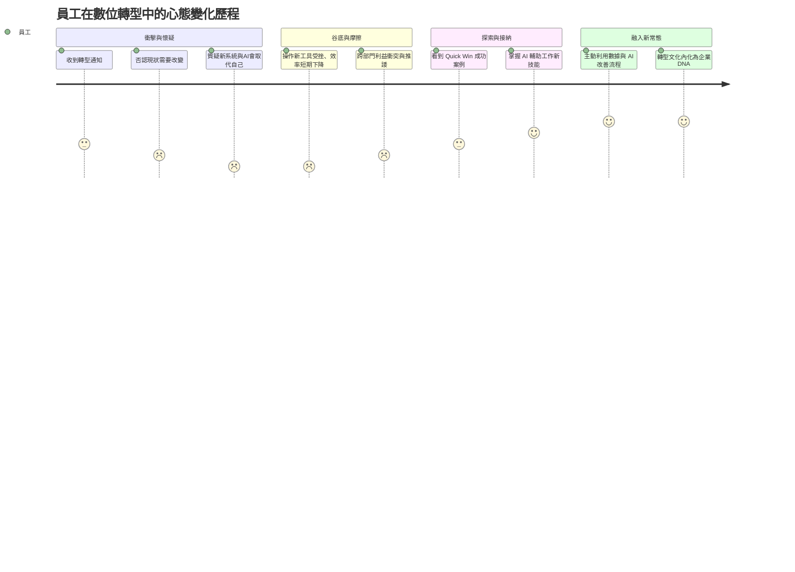
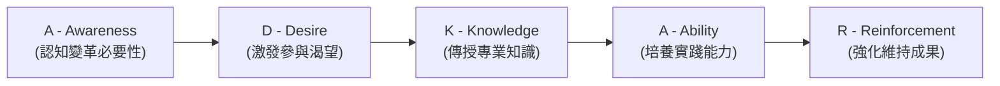
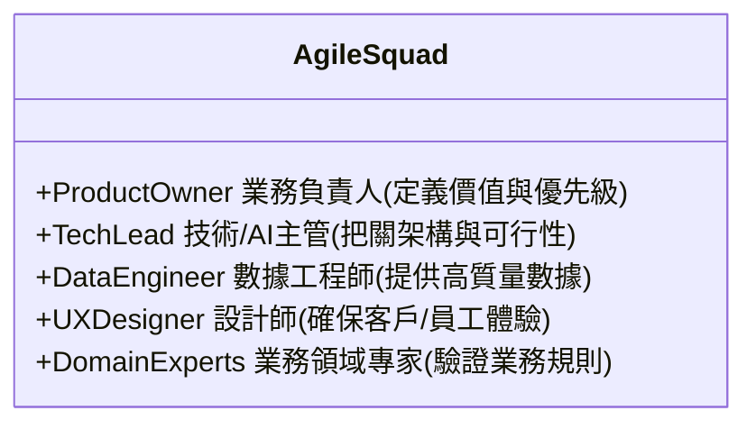
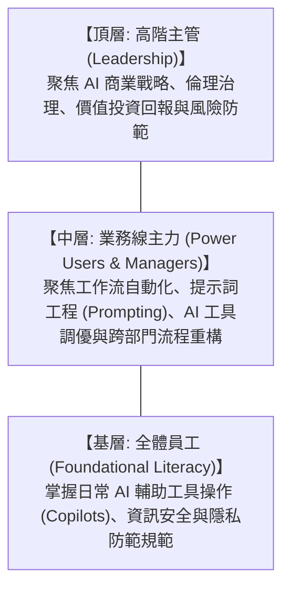

# 05: 組織變革、領導力與文化重塑 (Culture, Leadership & Change Management)

> **核心摘要 (Executive Summary)**  
> 知名管理學家彼得·杜拉克（Peter Drucker）曾說：「**文化能把戰略當早餐吃掉 (Culture eats strategy for breakfast)**」。根據麥肯錫與波士頓諮詢（BCG）的統計，超過 70% 的數位轉型失敗源於**組織阻力、跨部門內耗與文化缺乏適應力**，而非技術本身。本章將提供一套行之有效的組織變革框架與人才賦能機制。

---

## 🧗 1. 轉型過程中的組織心理阻力曲線 (The Change Curve)

任何重大技術或流程變革，員工心理都會經歷經典的「變革曲線 (Kubler-Ross Change Curve)」：

> **圖 05.1：轉型變革心理歷程與應對曲線圖 (The DX Change Curve Journey)**

> **📌 實戰個案剖析 (Case Study: 微軟 Microsoft 文化重塑歷程)**：
> 薩蒂亞·納德拉 (Satya Nadella) 上任微軟 CEO 時，將微軟從「無所不知 (Know-it-all)」的內鬥文化，轉變為「無所不學 (Learn-it-all)」的成長型思維。管理層不再懲罰失敗的專案，而是獎勵快速學習與分享教訓，成功帶領微軟市值從 3,000 億美元飆升至 3 兆美元。

---

## 🛠️ 2. ADKAR 變革管理模型在 DX 的落地實踐

企業應採用業界權威的 **Prosci ADKAR 模型**，按階段引導全員跨越心理門檻：

> **圖 05.2：Prosci ADKAR 變革五階段落地圖 (ADKAR Change Framework)**

> **📌 實戰個案剖析 (Case Study: 寶潔 P&G 全球供應鏈數位化 ADKAR 實踐)**：
> P&G 推動全自動化供應鏈時：
> - **Awareness & Desire**：CEO 親自拍影片說明「不數位化將失去零售巨頭訂單」，並設立節能創新大獎。
> - **Knowledge & Ability**：舉辦「數位學院」，讓 5,000 名工廠主管完成為期 4 週的實戰培訓。
> - **Reinforcement**：將供應鏈精準預測指標直接計入年終獎金，1 年內全美庫存缺貨率下降 40%。

| 階段 | 目標 (Objective) | 關鍵行動 (Key Actions) | 衡量標準 (Success Metrics) |
| :--- | :--- | :--- | :--- |
| **Awareness (認知)** | 讓全員理解「為什麼非變不可？不變的代價是什麼？」 | CEO 全員大會（Town Hall）、市場競爭危機洞察分享、客戶痛點影片展示。 | 全員調研中對轉型原因的理解度 > 85%。 |
| **Desire (渴望)** | 讓員工看見「這對我有什麼好處？（WIIFM - What's in it for me?）」 | 設立創新的激勵獎金、宣導 AI 能減輕瑣碎加班負擔、建立早期試點宣傳。 | 報名參與轉型志願者或 Pioneer 項目的人數。 |
| **Knowledge (知識)** | 系統化培訓新系統操作、現代數據思維與 AI 提示詞技能。 | 分級培訓工作坊（Bootcamp）、線上微課程、內部知識庫 (Notion/Wiki)。 | 培訓覆蓋率與測驗合格率。 |
| **Ability (能力)** | 將理論化為實際工作能力，提供試錯沙盒與指導。 | 設立內部「轉型教練 (Transformation Coaches)」、舉辦黑客松 (Hackathon)。 | 各部門自主發起並成功交付的改善提案數。 |
| **Reinforcement (強化)** | 防止團隊退回舊有的工作習慣。 | 將數位與 AI 工具使用率納入績效考核（KPI/OKR）、表彰最佳實踐團隊。 | 舊系統徹底停用（Decommission）與新平台活躍度。 |

---

## 🤝 3. 跨職能敏捷協同機制 (Breaking Silos: The Squad Model)

打破傳統依照職能劃分的「深井式部門（Siloed Org）」，轉向以商業價值交付為導向的跨職能小組（Squads）：

> **圖 05.3：跨職能 Squad 小組角色與協同關係圖 (Agile Squad Class Diagram)**

> **📌 實戰個案剖析 (Case Study: 荷蘭 ING 銀行敏捷組織轉型)**：
> ING 銀行取消了傳統的科層部門，將總部 2,500 名員工改組為 350 個跨職能 Squad。每個小組包含市場、風控、程式設計師，擁有完全自主權。轉型後產品上市時間縮短 60%，員工敬業度指標達到歷史新高。

---

## 🧠 4. 全員 AI 素養與賦能體系 (AI Literacy & Upskilling)

推動「全員 AI 賦能計畫（AI for Everyone）」，依據層級打造三層金字塔式培訓：

> **圖 05.4：三層金字塔全員 AI 素養培訓架構圖 (AI Literacy Pyramid)**

> **📌 實戰個案剖析 (Case Study: 亞馬遜 Amazon 的「Machine Learning University」)**：
> 亞馬遜建立內部機器學習大學，任何人（包括物流倉管員與客服）都可以免費進修。已有超過 10 萬名非技術員工獲得認證，衍生出上千個一線員工自主發起的自動化創新，成為亞馬遜最強大的基層生產力引擎。

---

## 👑 5. 領導力轉型：從「命令控制」到「僕人式賦能」 (Digital Leadership)

> [!TIP]
> 數位時代的卓越領導者具備以下特質：
> 1. **Psychological Safety (營造心理安全感)**：鼓勵團隊大膽嘗試新工具與新方法，將失敗視為學習的契機。
> 2. **Data-Driven Humility (以數據為師)**：在決策時放下 HiPPO (Highest Paid Person's Opinion 最高薪資者的主觀意見)，以 A/B 測試與數據事實說話。
> 3. **Clear Vision, Flexible Execution (清晰願景，彈性執行)**：對目標與願景堅定不移，但對實現手段保持開放與敏捷調整。

---

**下一單元**：探討轉型專案的具體落地步驟、MVP 擴展與風險治理：  
👉 **[06-execution-playbook-and-governance.md (落地執行篇：敏捷推進、MVP 與安全治理)](file:///c:/ai/digital-transformation/06-execution-playbook-and-governance.md)**
