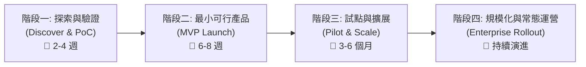
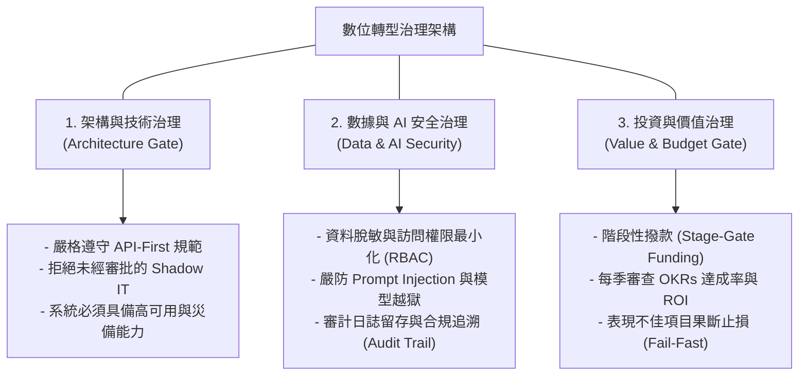

# 06: 專案落地執行、敏捷推進與治理手冊 (Execution Playbook & Governance)

> **核心摘要 (Executive Summary)**  
> 轉型專案最忌諱「規劃宏大卻難以落地」或「陷入漫長的 PoC 泥淖」。本章將提供一套從**試點篩選 (Pilot Selection)**、**雙軌敏捷交付 (Dual-Track Agile)**、**MVP 擴展矩陣 (Scaling Framework)** 到 **全面安全與合規治理 (Governance & Risk Management)** 的標準執行作業手冊。

---

## 🚀 1. 轉型落地實施四階段路線圖 (The 4-Phase Delivery Roadmap)

> **圖 06.1：轉型專案四階段落地交付全景圖 (The 4-Phase Delivery Roadmap)**



> **📌 實戰個案剖析 (Case Study: 宜家 IKEA 的 AR 家居四階段落地)**：
> 1. **PoC (3週)**：用 iPhone 簡單做個 3D 沙發投影 Demo 驗證空間比例。
> 2. **MVP (6週)**：推出精簡版 App，僅收錄 100 款熱銷家具提供 AR 擺放預覽。
> 3. **Pilot (3個月)**：在瑞典與英國市場試點，收集百萬用戶反饋並打通庫存 API。
> 4. **Scale (全球推廣)**：正式升級為 IKEA Kreativ 全球核心 App，用戶退貨率直接下降 25%。

### 各階段關鍵任務清單：
1. **階段一：探索與概念驗證 (Discover & PoC)**
   - 鎖定單一痛點明確、數據就緒的業務場景。
   - 快速組裝現成開源模型或 SaaS 工具完成技術可行性驗證（不強求完美架構）。
   - 驗收指標：是否能解決業務核心痛點？技術路徑是否暢通？
2. **階段二：最小可行產品 (MVP Launch)**
   - 串接真實業務系統（如 CRM、ERP 的核心 API）。
   - 打造精簡但具備完整業務閉環的功能，開放給 5%~10% 的早期使用者 (Beta Users)。
   - 驗收指標：使用者留存率、核心流程效率提升數據、直接意見回饋。
3. **階段三：業務試點與橫向擴展 (Pilot & Scale)**
   - 補齊日誌監控、自動化測試、資安加固與性能優化。
   - 推廣至單一完整部門或單一特定市場（如特定區域分公司）。
   - 驗收指標：硬性 ROI 指標（如成本節省金額、收入增量）達成率。
4. **階段四：全企業規模化推廣 (Enterprise Rollout)**
   - 全面替換舊系統，將新模式沉澱為標準 SOP 與組織常態能力。
   - 建立監控看盤與持續迭代機制。

---

## 🔄 2. 雙軌敏捷開發模式 (Dual-Track Agile Delivery)

為了避免「只顧埋頭開發卻偏離業務需求」，團隊應採用「探索軌 (Discovery Track)」與「交付軌 (Delivery Track)」並行的雙軌敏捷機制：

> **圖 06.2：雙軌敏捷探索與工程交付閉環流程圖 (Dual-Track Agile Loop)**

```mermaid
flowchart TD
    subgraph 軌道 1: 產品與業務探索 (Discovery Track - 驗證「做對的事」)
        D1["用戶調研 & 痛點梳理"] --> D2["原型設計 & 易用性測試"] --> D3["業務價值評估 & User Story 定義"]
    end

    subgraph 軌道 2: 工程與技術交付 (Delivery Track - 確保「把事做好」)
        E1["Sprint Planning (需求排程)"] --> E2["代碼編寫 & 系統整合"] --> E3["CI/CD 自動化發布與監控"]
    end

    D3 -->|"已驗證的高價值需求"| E1
    E3 -.->|"用戶真實使用數據回傳"| D1
```

> **📌 實戰個案剖析 (Case Study: Airbnb 雙軌敏捷推進體驗改版)**：
> Airbnb 的產品團隊在「探索軌」中每週快速利用 Figma 原型訪談 20 位房東，淘汰了 80% 偽需求；只有真正經過易用性驗證的高價值功能，才會進入「交付軌」交由工程師編寫代碼，避免了數千小時的無效開發浪費。

---

## 🛡️ 3. 企業級轉型治理與風險控制體系 (Enterprise Governance Framework)

建立跨部門的「數位轉型治理委員會 (Transformation Steering Committee)」，建立三大核心防線：

> **圖 06.3：數位轉型三道防線治理架構圖 (Three Lines of Defense Governance)**



> **📌 實戰個案剖析 (Case Study: 滙豐銀行 HSBC 的 Stage-Gate 治理)**：
> 滙豐銀行對內部 AI 與轉型專案實施「分階段注資（Stage-Gate Funding）」。PoC 階段僅撥發 5 萬美元，若驗證通過並具備資安合規性才撥發 30 萬美元進入 MVP，每年為銀行淘汰超過 40 個低產出專案，將資金集中於最高回報的旗艦項目。

---

## 📊 4. 數位轉型即時健康度儀表板 (DX Health Scorecard)

成功的治理需要透過量化指標進行即時監控：

| 指標維度 | 核心 KPI 項目 | 監控頻率 | 預警門檻 (Red Flag) |
| :--- | :--- | :--- | :--- |
| **價值產出 (Value Delivery)** | 累計實現財務價值 vs. 預算消耗比 | 每月 (Monthly) | 價值實現進度 < 預算消耗進度 20% 以上 |
| **產品與技術交付 (Delivery Speed)** | 需求交付前置時間 (Lead Time)、發布頻率 | 每兩週 (Bi-weekly) | 單一需求交付週期 > 3 個月 |
| **用戶與員工採納 (Adoption & Usage)** | 活躍用戶數 (DAU/MAU)、新流程使用率 | 每週 (Weekly) | 新系統操作覆蓋率 < 60% (說明員工仍在用舊線下方式) |
| **系統品質與穩定性 (Reliability)** | 系統可用性 (Uptime SLA)、重大缺陷數 | 即時 (Real-Time) | 核心服務可用性 < 99.9% 或發生數據洩漏事件 |
| **團隊士氣與變革體驗 (Team Health)** | 員工轉型滿意度評分 (eNPS) | 每季 (Quarterly) | eNPS 出現顯著負向下滑 |

---

## 🛑 5. 止損機制與敏捷覆盤 (Fail-Fast & Pivot Playbook)

> [!IMPORTANT]
> 轉型必然伴隨不確定性。建立明確的「專案止損線」不是承認失敗，而是保護企業資源：
> 1. **時間盒原則 (Timeboxing)**：PoC 驗證期嚴格限制在 4 週內，若 4 週內無法證明核心業務價值，立即停止追加預算。
> 2. **無痛轉向 (Pivot or Persevere)**：每季進行項目覆盤會（Post-Mortem Review），若市場環境劇變或技術假說被推翻，及時調整方向。
> 3. **免責覆盤文化 (Blameless Post-Mortem)**：總結失敗專案中獲得的數據沉澱、架構組件與經驗教訓，獎勵勇於探索未知的團隊。

---

**下一單元**：深度解析真實世界中的經典成功範例與致命失敗案例：  
👉 **[07-case-studies-and-anti-patterns.md (實戰案例篇：成功路徑與避坑指南)](file:///c:/ai/digital-transformation/07-case-studies-and-anti-patterns.md)**
