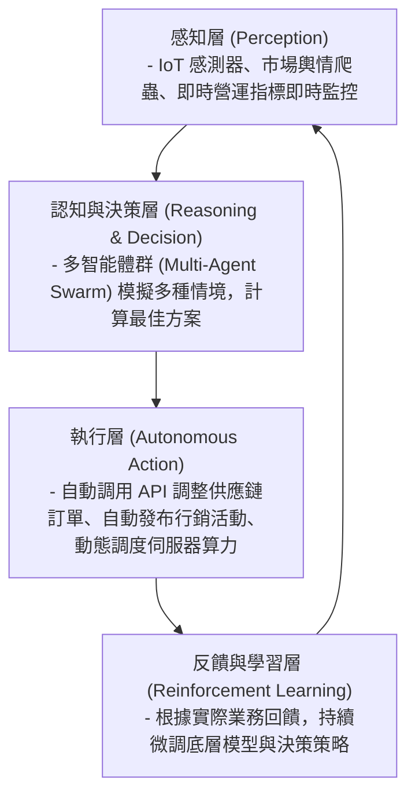

# 08: 專家巔峰實踐、組合式架構與未來自主企業 (Mastery & Future-Proofing)

> **核心摘要 (Executive Summary)**  
> 數位轉型的終局並不是「變成一家普通的軟體公司」，而是進化為一個具備**極致敏捷性 (Extreme Agility)**、**高度模組化 (Composable Architecture)** 與 **自我學習演進能力 (Autonomous Self-Adaptive Enterprise)** 的智慧生命體。本章將為高階架構師與 CXO 提供一份邁向最高成熟度的實踐手冊與自我診斷工具箱。

---

## 🧩 1. 組合式企業架構 (The Composable Enterprise & PBCs)

Gartner 提出的「組合式架構」是未來應對不確定市場的核心解法：

> **圖 08.1：組合式企業 PBC 模組化與智能編排架構圖 (Composable Enterprise & PBC Architecture)**

```mermaid
flowchart TD
    subgraph 打包業務能力層 (Packaged Business Capabilities - PBCs)
        PBC1["客戶身分與畫像 PBC"]
        PBC2["即時動態定價 PBC"]
        PBC3["智慧物流與倉儲 PBC"]
        PBC4["多通路結算與支付 PBC"]
    end

    subgraph 業務編排與智能代理層 (Agentic Orchestration Layer)
        ORCH["AI Agent 智能工作流編排器<br/>(動態監控市場供需，自動組合 PBCs 生成新產品)"]
    end

    subgraph 敏捷前台應用層 (Experience Frontends)
        APP1["B2B 客戶專屬門戶"]
        APP2["智慧門市 AR/VR 終端"]
        APP3["第三方合作夥伴 API 生態"]
    end

    PBC1 & PBC2 & PBC3 & PBC4 --> ORCH
    ORCH --> APP1 & APP2 & APP3
```

> **📌 實戰個案剖析 (Case Study: 快時尚巨頭 SHEIN 的 PBC 組合式即時供應鏈)**：
> SHEIN 將「面料採購」、「打版設計」、「小批量生產（100件）」與「海外物流」全部封裝為獨立的微服務 API (PBCs)。演算法即時偵測 TikTok 熱門流行元素後，系統在 2 小時內自動組合調度供應鏈 PBCs 完成下單生產，7 天內送達歐美消費者手中，完美展現了組合式企業的極致彈性。

### 組合式企業的三大核心要素：
1. **Composable Thinking (組合式思維)**：將所有業務流程拆解為獨立、可復用的微型能力模組。
2. **Composable Business Architecture (組合式業務架構)**：定義清晰的 **PBC (Packaged Business Capabilities 打包業務能力)**，每個模組具備獨立 API 與數據契約。
3. **Composable Technologies (組合式技術棧)**：全面採用 **MACH 原則 (Microservices, API-first, Cloud-native SaaS, Headless)**。

---

## 🤖 2. 自主企業的終極願景 (The Autonomous Enterprise)

隨著多智能體協同 (Multi-Agent Systems) 的成熟，企業正在由「人驅動軟體」轉向「AI 智能體自主協同，人類把關戰略」：

> **圖 08.2：自主企業感知-決策-執行-學習智能閉環圖 (The Autonomous Enterprise Loop)**



> **📌 實戰個案剖析 (Case Study: 特斯拉 Tesla 智慧工廠與端到端自主運作)**：
> 特斯拉超級工廠將生產線機器人、零件供應商與車載遙測數據聯網，演算法即時感知某個螺絲扭矩異常時，會自動調度維護機器人、通知零件商補貨，並同步 OTA 更新全球車隊韌體，人類工程師僅需在高階指揮中心監控戰略指標。

---

## 📊 3. 企業級數位與 AI 成熟度綜合自我評估矩陣 (Mastery Audit Tool)

請針對以下 6 個關鍵維度進行自我評分（每項滿分 5 分，總分 30 分）：

| 評估維度 (Dimensions) | 1 分 (初級 / 滯後) | 3 分 (中級 / 發展中) | 5 分 (專家級 / 領先) | 自我評分 (1-5) |
| :--- | :--- | :--- | :--- | :--- |
| **1. 戰略與 ROI (Strategy & ROI)** | 無明確戰略，僅被動購買軟體；無可量化 ROI。 | 具備部門級 OKRs，有清晰的試點專案與投資回報預估。 | 全公司戰略以數位與 AI 為核心，持續孵化新商業模式。 | [ ] 分 |
| **2. 架構與解耦 (Tech Architecture)** | 封閉單體系統 (Monolith)，無開放 API，依賴實體機房。 | 核心業務上雲，具備標準 REST API，部分微服務化。 | 全面 MACH 原則，無伺服器 (Serverless) 與事件驅動架構。 | [ ] 分 |
| **3. 數據底座 (Data Maturity)** | 數據分散於孤立 Excel/局部數據庫，無統一治理。 | 具備集中式數據湖倉，提供定期 BI 報表與基礎預測。 | 實現 Data Mesh 數據網格，數據即產品，具備即時語意層。 | [ ] 分 |
| **4. AI 與自動化 (AI Acceleration)** | 僅個別員工零散使用 ChatGPT，企業無官方 AI 應用。 | 導入 RAG 企業知識庫，關鍵流程具備 Copilot 輔助。 | 實現 Agentic Workflows，多智能體自主完成跨系統閉環。 | [ ] 分 |
| **5. 組織與文化 (Culture & Agility)** | 層層審批官僚文化，員工排斥新技術，懼怕被 AI 取代。 | 建立跨職能 Squad 小組，全員開展 AI 素養培訓。 | 敏捷試錯與心理安全感，全員主動以數據與 AI 解決問題。 | [ ] 分 |
| **6. 治理與安全 (Security & Governance)** | 無轉型治理機制，資安僅在出事後補救，存在 Shadow IT。 | 建立階段性評審委員會，具備基礎權限管控 (RBAC)。 | 零信任 (Zero Trust) 架構，內建 DevSecOps 與 AI 倫理審計。 | [ ] 分 |

### 診斷結論解讀：
- **6 ~ 12 分 (Level 1: 起步階段)**：應專注於基礎資料數位化與消除最繁瑣的手工流程，優先建立單一專案的 Quick Win。
- **13 ~ 20 分 (Level 2: 加速階段)**：應著重打通數據孤島，建立 API 標準與跨職能敏捷小組，規模化推動 RAG 與 AI 工具。
- **21 ~ 30 分 (Level 3: 領導者階段)**：已具備強大的數位飛輪效應，應探索組合式架構、自主智能體編排與產業生態系構建。

---

## 🏁 4. 結語：轉型是一場無限遊戲 (The Infinite Game)

數位轉型與 AI 革命不是一場有終點線的百米衝刺，而是一場比拼**適應力 (Adaptability)** 與 **演化速度 (Speed of Evolution)** 的無限遊戲。

> [!TIP]
> 記住推動變革的三大黃金法則：
> 1. **Think Big (心懷遠大願景)**：從商業模式本質與客戶價值出發，敢於重新定義行業規則。
> 2. **Start Small (從小處快速切入)**：挑選最痛、最有價值的小切口，用 AI 工具迅速打造可運行的 MVP。
> 3. **Scale Fast (以數據為舵快速擴展)**：建立可度量的指標體系，快速迭代、快速止損、持續進化！

---

恭喜您完成全部課程！隨時回顧各模組：  
- [00: 課程總綱與學習地圖](file:///c:/ai/digital-transformation/00-curriculum-overview.md)
- [01: 基礎篇 — 什麼是數位轉型？](file:///c:/ai/digital-transformation/01-what-is-digital-transformation.md)
- [02: 戰略篇 — 轉型戰略、商業模式與 ROI](file:///c:/ai/digital-transformation/02-dx-strategy-and-value-creation.md)
- [03: 技術底座篇 — Cloud, API 與 Data Mesh](file:///c:/ai/digital-transformation/03-modern-tech-and-data-foundation.md)
- [04: AI 提速篇 — 生成式 AI 與 Agentic 轉型引擎](file:///c:/ai/digital-transformation/04-ai-and-agentic-dx-acceleration.md)
- [05: 組織變革篇 — 文化、領導力與人才賦能](file:///c:/ai/digital-transformation/05-culture-leadership-and-change-management.md)
- [06: 落地執行篇 — 敏捷推進、MVP 與安全治理](file:///c:/ai/digital-transformation/06-execution-playbook-and-governance.md)
- [07: 實戰案例篇 — 成功路徑與避坑指南](file:///c:/ai/digital-transformation/07-case-studies-and-anti-patterns.md)
- [08: 專家巔峰篇 — 組合式企業與自主企業未來](file:///c:/ai/digital-transformation/08-mastery-and-future-proofing.md)
